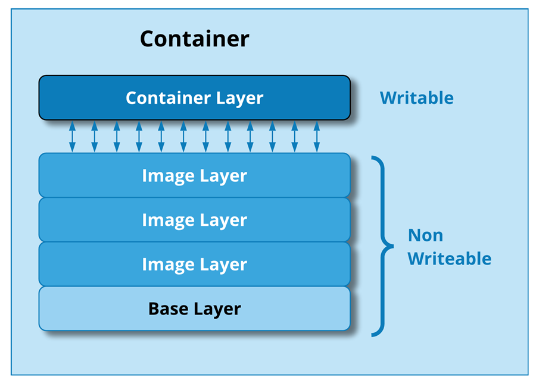

# Dockerize Microservices and run using Docker CLI and Docker Compose
  #### 1. Docker Desktop
  #### 2. Dockerfile
  #### 3. Docker Image
  #### 4. Docker Container
  #### 5. Docker Commands
  #### 6. Docker Compose
  #### 7. Run Microservices using Docker CLI
  #### 8. Run Microservices using Docker Compose

  GitRepo: https://github.com/santosh-gh/online-store-01

> [!NOTE]
> This example and source code is taken from Microsoft Documentations for FREE demo and learning purposes. 

# Online Store

This sample app consists of a group of containerized microservices that can be easily deployed into Kubernetes. 
This is meant to show a realistic scenario using a polyglot architecture, event-driven design, and common open 
source back-end services (eg - RabbitMQ). 

> [!NOTE]
> This is not meant to be an example of perfect code to be used in production, but more about showing a 
  realistic application running in Kubernetes. 

# Architecture

The application has the following services: 

| Service | Description |
| --- | --- |
| `order-service` | This service is used for placing orders (Javascript) |
| `product-service` | This service is used to perform CRUD operations on products (Rust) |
| `store-front` | Web app for customers to place orders (Vue.js) |
| `rabbitmq` | RabbitMQ for an order queue |

# Microservices

  A software design approach where an application is built as a collection of small, independent 
  services that communicate with each other using lightweight protocols usually 
  HTTP/REST, gRPC, or messaging queues.

  ## Each microservice

    Runs in its own process.

    Is independently deployable & scalable.

    Owns its data & logic (usually with its own database).

    Focuses on a specific business capability (messaging, product, order processing).

  ## Advantages of Microservices

    Scalability – Scale only the required service instead of the whole app.

    Flexibility – Different service can use different programming languages, databases, frameworks.

    Resilience – Failure in one microservice doesn’t take down the whole system.

    Faster Development & Deployment – Teams work independently, allowing for CI/CD and faster releases.

    Reusability – Microservices can be reused across different projects.

    Easier Maintenance – Smaller codebases are easier to manage and test.

# What is Docker?

  

  An open-source platform that allows developers to build, package, and run applications inside containers.
  A container is a lightweight, portable, and isolated environment that includes everything 
  needed to run an application.

  - Application code
  - Libraries
  - Dependencies
  - Configurations

  This makes applications run the same way on any environment (developer laptop, testing server, or cloud).

  ## Docker Components 

  

    # Docker Engine
      - Runs and manages containers. It Contains
      - Docker Daemon: Runs in the background, manages images, containers, networks and volumes.
      - Docker Client/CLI: Tool to interact with the daemon.
      - REST API: Lets apps talk to Docker programmatically.

    # Dockerfile
      - A set of instructions (commands) used to build a Docker image.
      - Each instruction adds a layer to the image.

    # Docker Images
      - image is a file which contains dependencies, binaries and required 
        configurations to run software inside a container.(static, read-only)
      - Immutable (cannot be changed once built).

    # Docker Containers
      - A running instance of a Docker image (dynamic, running).
      - Containers are isolated but can communicate via networking.

    # Docker Hub (Registry): 
      - A repository where Docker images are stored.

    # Docker Compose: A tool to define and run multi-container applications.
      - Uses a docker-compose.yml file. 
      - Define app services in one file (docker-compose.yml).
      - Reproducible environments -> same setup runs on any machine.
      - Simplifies orchestration (without Kubernetes). 

    # Docker Networks: 
      - Helps Docker containers to communicate with each other, 
        the host machine, and external systems.  
      - Like a Local Area Network inside Docker.
      - Types: bridge (default), host, none, overlay, macvlan.  

    # Docker Volume: 
      - A mechanism to persist data generated and used by Docker containers.  
      - Store data outside the container, making it persistent and shareable across containers 
      - Data persistence (data survives container restarts/deletion).
      - Sharing data between multiple containers.
      - Better performance than storing data inside the container filesystem.
      - Backup & restore support.
  
  

    - Images = stack of read-only layers.
    - Containers = image layers + a writable top layer.

  ## Docker files 

    A text file that contains a set of instructions for building a Docker image.

    # Essential Instructions

      FROM -> defines the base image.

      RUN -> runs commands (e.g., install software).

      CMD -> sets the default command when the container runs.

      ENTRYPOINT -> defines the main command that always runs, even if you pass arguments.

      WORKDIR -> sets the working directory inside the container.
      
    # File & Directory Management

      COPY -> copies files from host into the image.

      ADD -> like COPY, but also supports remote URLs and automatic archive extraction (e.g., .tar.gz).

      VOLUME -> creates a mount point for persistent data or shared volumes.

    # Configuration & Environment

      ENV -> sets environment variables.

      ARG -> defines build-time variables (different from ENV because these don’t persist 
             at runtime unless passed).

      LABEL -> adds metadata to the image (author, version, description).

      USER -> sets the user to run commands as (instead of root).

      SHELL -> changes the default shell used in RUN commands (e.g., ["powershell", "-Command"] on Windows).

    # Networking & Ports

      EXPOSE -> documents which ports the container will listen on.

    # Build Optimizations

      ONBUILD -> triggers instructions when the image is used as a base for another build.

      STOPSIGNAL -> sets the system call signal used to stop the container.

      HEALTHCHECK -> defines a command for checking container health (e.g., ping a service).

    # Security & Permissions

      USER -> runs commands as a specific user/group.

      CHOWN (used in COPY/ADD) -> sets ownership of copied files.

  ## Docker Commands

    # Check Docker version
    docker --version
    docker info

    # Get help
    docker --help

    # Images
    List images
    docker images

    Pull an image
    docker pull <image_name>:<tag>

    Remove an image
    docker rmi <image_id>

    Build an image from Dockerfile
    docker build -t <image_name>:<tag> .

    Tag an image
    docker tag <image_id> <new_name>:<tag>

    # Containers
    List running containers
    docker ps

    List all containers (including stopped)
    docker ps -a

    Run a container
    docker run -d --name <container_name> <image_name>

    Run interactively with shell
    docker run -it <image_name> /bin/bash

    Start/Stop container
    docker start <container_id>
    docker stop <container_id>

    Restart container
    docker restart <container_id>

    Remove container
    docker rm <container_id>

    Logs
    docker logs -f <container_id>

    Execute command in running container
    docker exec -it <container_id> /bin/bash

    # Volumes & Data
    List volumes
    docker volume ls

    Create volume
    docker volume create <volume_name>

    Mount volume
    docker run -v <volume_name>:/path/in/container <image_name>

    # Networking
    List networks
    docker network ls

    Create network
    docker network create <network_name>

    Connect container to network
    docker network connect <network_name> <container_id>

    Disconnect container from network
    docker network disconnect <network_name> <container_id>

    # Docker Compose
    Start services
    docker-compose up -d

    Stop services
    docker-compose down

    Restart services
    docker-compose restart

    View logs
    docker-compose logs -f

    # Cleanup
    Remove stopped containers
    docker container prune

    Remove unused images
    docker image prune

    Remove unused volumes
    docker volume prune

    Remove everything unused
    docker system prune -a

# Install Docker Desktop

    Windows: https://docs.docker.com/desktop/setup/install/windows-install/
    Linux:   https://docs.docker.com/desktop/setup/install/linux/
    Mac:     https://docs.docker.com/desktop/setup/install/mac-install/   

# Dockerize the Microservices

  ## RabbitMQ: 
    Message broker, provides the messaging backbone. Should run first.
    Pull the image from Microsoft Repository

  ## Create Order-service
    Consumes/Produces messages via RabbitMQ.
    Connects to RabbitMQ for handling order messages.
    Add a Dockerfile

  ## Product-service
    Provides product-related APIs/data.
    Add a Dockerfile

  ## Store-front
    Frontend gateway that depends on both product and order services. 
    This is the entry point for users. It calls product-service (for catalog) and 
    order-service (for placing orders).

    Add a Dockerfile

  ## Network
    A custom bridge network where all services can communicate with each other 
    by service name (e.g., rabbitmq, order-service).
    Create a Network

  ## Volume
    Add Plugin to RabbitMQ using volume
    Create a volume for adding the Plugins 

# Run Microservices with Docker CLI

  ## Build images

    Order Service
    docker build -t order-service src/order-service

    Product Service
    docker build -t product-service src/product-service

    Store Front Service
    docker build -t store-front src/store-front 

    docker images       

  ## Create a network 
    Talk to each other by container name

    docker network create backend_services

  ## Run containers
  
  ### RabbitMQ

    docker run -d \
    --name rabbitmq \
    --restart always \
    --network backend_services \
    -p 15672:15672 \
    -p 5672:5672 \
    -e RABBITMQ_DEFAULT_USER=username \
    -e RABBITMQ_DEFAULT_PASS=password \
    -v $(pwd)/rabbitmq_enabled_plugins:/etc/rabbitmq/enabled_plugins \
    rabbitmq:3.13.2-management-alpine

    Note: 
    rabbitmq_management - Web UI & REST API.
    rabbitmq_prometheus - Metrics endpoint for Prometheus/Grafana.
    rabbitmq_amqp1_0 - Extra protocol support (AMQP 1.0). 

    Health checks can’t be enforced automatically like Compose, but you can 
    check manually with:
    
    docker exec rabbitmq rabbitmqctl status

  ### Order Service

    Since it depends on RabbitMQ, we can wait until RabbitMQ is healthy (or just sleep a few seconds).

    docker run -d \
    --name order-service \
    --restart always \
    --network backend_services \
    -p 3000:3000 \
    -e ORDER_QUEUE_HOSTNAME=rabbitmq \
    -e ORDER_QUEUE_PORT=5672 \
    -e ORDER_QUEUE_USERNAME=username \
    -e ORDER_QUEUE_PASSWORD=password \
    -e ORDER_QUEUE_NAME=orders \
    -e ORDER_QUEUE_RECONNECT_LIMIT=3 \
    order-service      

  ### Product Service

    docker run -d \
    --name product-service \
    --restart always \
    --network backend_services \
    -p 3002:3002 \
    product-service
        
  ### Store Front        
    docker run -d \
    --name store-front \
    --restart always \
    --network backend_services \
    -p 8080:8080 \
    store-front

    Depends on order-service and product-service, so wait a few seconds for them to start:

  ### Note:    

    Health Checks: Docker Compose automatically waits for services to be healthy. 
    With docker run, we need manual checks.

    Depends_on: Not supported in docker run. You handle this by manually waiting 
    or using a script to check health.

    Volumes: Only RabbitMQ uses one volume. Others are just built images.

    Network: All containers must use the same backend_services network to communicate 
    by container name.

  ### Inspect RabbitMQ plugins:

    docker exec -it rabbitmq rabbitmq-plugins list
    docker exec -it rabbitmq cat /etc/rabbitmq/enabled_plugins

    Use the Management UI

    Open: http://localhost:15672
    Login with the credentials set in docker-compose.yml (username / password).

  ## Access services

      http://localhost:8080

  ## Scripts

      ./run-store-service.sh
  
  ## Cleanup
      
      docker ps
      docker stop <container-id>
      docker rm <container-id>

      docker images
      docker rmi <image-id>

# Run Microservices with Docker Compose

  A tool that define and manage multi-container Docker applications using a single 
  configuration file (usually docker-compose.yml).

  Instead of starting each container manually with docker run, Compose declare all the services, 
  networks, and volumes in one file and bring them up with a single command.

  ## Create Docker Compose file    

  ### rabbitmq

    Image: Uses rabbitmq:3.13.2-management-alpine (lightweight version with management UI).

    Purpose: Acts as the message broker that other services use 
    for communication (publish/subscribe to queues).

    Environment variables:

    RABBITMQ_DEFAULT_USER and RABBITMQ_DEFAULT_PASS -> set default login credentials.

    Ports:

    15672 -> management UI (accessible in browser).

    5672 -> AMQP protocol for communication between services.

    Healthcheck: Runs rabbitmqctl status every 30s to verify RabbitMQ is healthy.

    Volumes: Mounts enabled_plugins configuration (so custom plugins can be enabled).                         

    Network: Connected to backend_services.

  ### order-service

    Builds from: src/order-service (custom microservice).

    Purpose: Handles orders (likely consuming messages from RabbitMQ).

    Ports:

    3000:3000 -> service exposed on host port 3000.

    Healthcheck: Hits http://order-service:3000/health to check liveness.

    Environment variables: Defines RabbitMQ connection details:

    Host (rabbitmq), port (5672), credentials, queue name (orders).

    ORDER_QUEUE_RECONNECT_LIMIT=3 -> retry limit for connecting to RabbitMQ.

    Dependency:

    depends_on.rabbitmq.condition: service_healthy -> order-service will 
    only start after RabbitMQ is up and healthy.

    Network: backend_services.

  ### product-service

    Builds from: src/product-service.

    Purpose: Handles product-related data (catalog, pricing, availability, etc.).

    Ports:

    3002:3002 -> exposed on host port 3002.

    Healthcheck: Hits http://product-service:3002/health.

    Dependency: None explicitly, but it’s on the same network 
    so other services (like store-front) can reach it.

    Network: backend_services.

  ### store-front

    Builds from: src/store-front.

    Purpose: The UI / API gateway for customers (frontend of the system).

    Ports:

    8080:8080 -> exposed on host port 8080 (probably web UI).

    Healthcheck: Hits http://store-front:80/health (⚠️ note: inside container 
    it expects port 80, even though externally mapped to 8080).

    Dependencies:

    Depends on product-service and order-service (ensures they start first).

    Network: backend_services.

  ### networks

    backend_services: A custom bridge network where all services can communicate 
    with each other by service name (e.g., rabbitmq, order-service).

  ## Run Services 

      docker compose up

  ## Access Services

  ## Docker Compose Commands

  ### Service life cycle
    docker compose up
    docker compose down
    docker compose start
    docker compose stop
    docker compose restart
    docker compose pause
    docker compose unpause

  ### Service & Container Management
    docker compose ps
    docker compose kill

  ### Build & Images
    docker compose build
    docker compose pull
    docker compose push
    docker compose images

  ### Logs & Debugging
    docker compose logs
    docker compose top       
    docker compose config

  ### Scale
    docker compose up -d --scale <service>=<num>

# Run on Local Kubernetes (Minikube)

# Run on Local Kubernetes (KinD)

# Run the app on Azure Kubernetes Service (AKS)

# References

    Docker Installation Steps in Windows & Mac OS
    https://medium.com/@javatechie/docker-installation-steps-in-windows-mac-os-b749fdddf73a

    How to Install Docker on Windows
    https://medium.com/@supportfly/how-to-install-docker-on-windows-bead8c658a68

    Step-by-Step Tutorial: Installing Docker and Docker Compose on Ubuntu
    https://tomerklein.dev/step-by-step-tutorial-installing-docker-and-docker-compose-on-ubuntu-a98a1b7aaed0

kubectl port-forward service/store-front 8080:80
